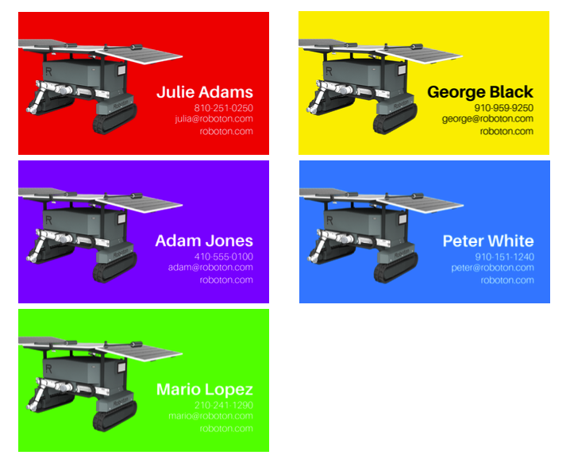
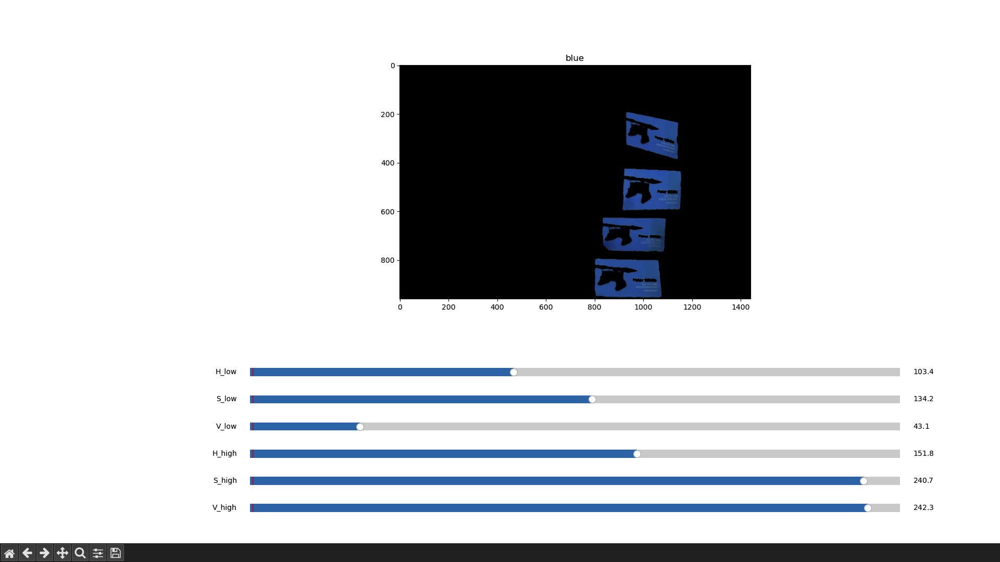
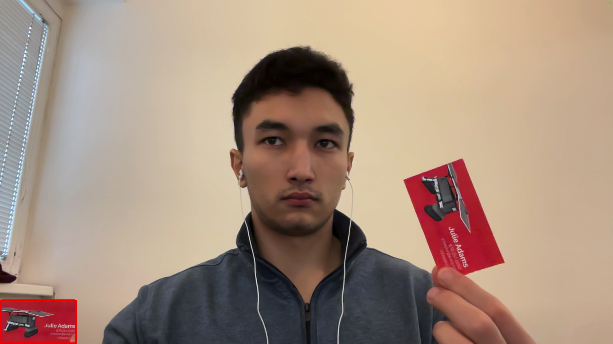
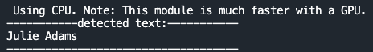

## Installation

clone project: 
 ``git clone https://github.com/BKairat/cards_detection.git``

### Prepare environment
MacOs/Linux: ``bash installation.sh``

Win: ``bash installationWin.sh``

### Activete venv

MacOs/Linux: ``source venv/bin/activate``

Win: ``venv\Scripts\activate``

#### Install requirements

``pip install -r requirements.txt``

## Calibration
to calibrate colors for your camera add your "calibration_image.png" (calibration image must contain card of red, green, blue, yellow and violet cards) to images/camera.

Example of calibration image:

{: height="400px"}

``python3 calibration.py camera``

or you can test on prepared image

``python3 calibration.py test``

Example calibration for blue color:

{: height="400px"}

## Example of usage
testing on prepared images:

``python3 image_processing.py``

use your camera:

``python3 main.py``

press:
+ ``q`` to quite 
+ ``s`` to save image
+ ``space`` to find card and text if it's possible

text will be printed in terminal

## Results

you can see the other images in `results`

{: height="400px"}

{: height="400px"}

