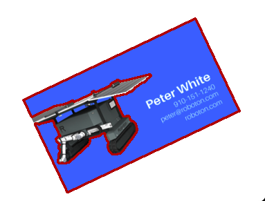
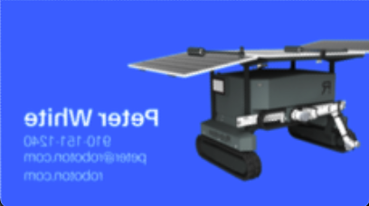
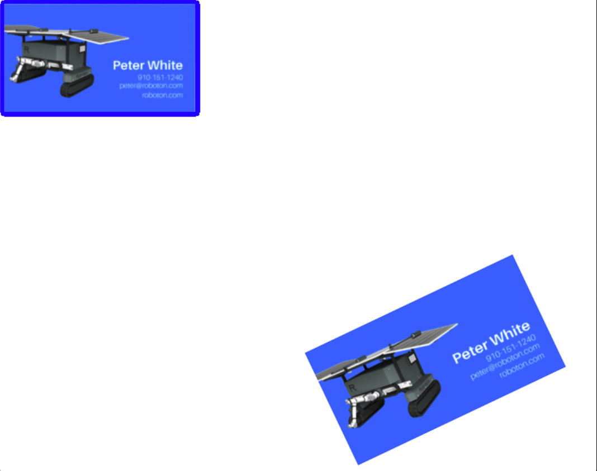
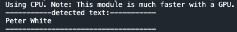

## Installation

clone project: 
 ``git clone https://github.com/BKairat/cards_detection.git``

### Prepare environment
MacOs/Linux: ``bash installation.sh``

Win: ``bash installationWin.sh``

### Activete venv

MacOs/Linux: ``source venv/bin/activate``

Win: ``venv\Scripts\activate``

## Calibration
to calibrate colors for your camera add your "calibration_image.png" (calibration image must contain card of red, green, blue, yellow and violet cards) to images/camera.

Example of calibration image:

``python3 calibration.py camera``

or you can test on prepared image

``python3 calibration.py test``

Example calibration for blue color:

## Example of usage
testing on prepared images:

``python3 image_processing.py``

use your camera:

``python3 main.py``

press:
+ ``q`` to quite 
+ ``s`` to save image
+ ``space`` to find card and text if it's possible

text will be printed in terminal

## Results

you can see the other images in `results`

## How it works

The resulting image is converted to HSV format and the outline of the card is determined by color:

It is assumed that the colors have been correctly calibrated so the larger outline will belong to the card:

After that we approximate the contour to a convex one and then to a quadrilateral:

Then the card is aligned using an affine transformation

Using the Canny algorithm, we determine the contours on the card, and depending on which corners have the fewest contours, we reflect the card horizontally and vertically:

Final result:

the text on the card is determined using the ``easyocr`` library, and displayed is score is higher then 0.6 

